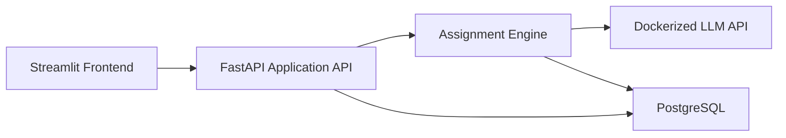
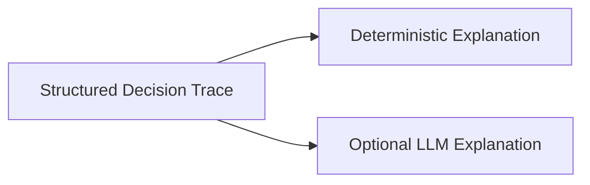
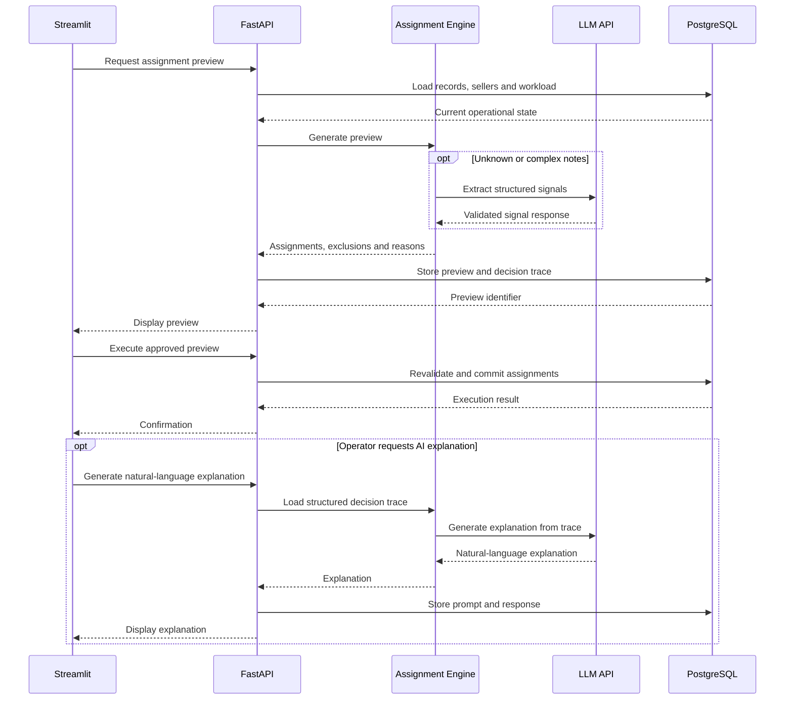

# Sales Assignment System Architecture

## 1. Objective

Build a small, explainable platform for reviewing commercial data, generating assignment previews, executing approved assignments, and auditing every decision.

The system uses a Streamlit frontend, a FastAPI application API, an independent Dockerized LLM API, an assignment engine, and a relational database.

## 2. Main Components

| Component | Responsibility |
|---|---|
| Streamlit Frontend | Data review, record selection, method configuration, preview, execution, reassignment, and audit views. |
| FastAPI Application API | Entry point for the frontend. Coordinates validation, previews, execution, persistence, and audit operations. |
| Assignment Engine | Applies eligibility rules, builds seller profiles, runs the selected assignment method, and returns structured reasons. |
| LLM API | Independent Dockerized service used for note interpretation and optional natural-language explanations. |
| PostgreSQL | Stores cleaned data, extracted signals, seller profiles, previews, assignments, and immutable audit events. |

## 3. System Context



Streamlit does not assign records directly. It requests a preview from FastAPI, displays the result, and asks FastAPI to execute the approved preview.

## 4. Main Workflow

### 4.1 Data preparation

1. The operator loads the supplied data.
2. FastAPI validates and normalizes the records.
3. Data-quality issues are stored and displayed in Streamlit.
4. Historical company–seller relationships are reconstructed from activity.
5. Cleaned and original values remain available for audit.

### 4.2 Note interpretation

The system first applies known deterministic mappings. When a note cannot be interpreted confidently, the Assignment Engine calls the LLM API.

The LLM returns structured signals such as:

- Senior representative requested.
- Sector expert requested.
- Technical expertise required.
- Urgent or competitive process.
- Complex or multi-site account.
- Preferred contact channel or time.
- Do-not-contact request.
- Possible duplicate.

The response must be validated before it becomes part of the assignment context. Operators can review and edit the extracted signals in Streamlit.

### 4.3 Assignment preview

1. The operator selects records and one assignment method.
2. FastAPI loads the latest record, seller, capacity, absence, and workload data.
3. The Assignment Engine removes ineligible combinations.
4. The selected method produces proposed assignments and structured reasons.
5. FastAPI stores the preview and its complete trace.
6. Streamlit displays assignments, warnings, exclusions, and reasons.

### 4.4 Execution

1. The operator approves a preview.
2. FastAPI verifies that the underlying data has not changed.
3. Valid assignments are committed together.
4. An immutable audit event is stored for every assignment.
5. If the preview is stale, execution is rejected and a new preview is required.

## 5. Assignment Methods

The Assignment Engine exposes four methods:

1. **Round Robin** — sequential distribution among eligible sellers.
2. **Capacity-Aware** — favors sellers with more available capacity and lower utilization.
3. **Fuzzy Optimal Assignment** — evaluates gradual concepts such as seniority, experience, speed, capacity, and account complexity before balancing the complete batch.
4. **AI-Assisted Optimal Assignment** — uses structured note signals and seller profiles while preserving all mandatory constraints.

Every method returns the same output structure so the frontend can compare them consistently.

## 6. Optional LLM Explanation

The official decision trace is generated by the Assignment Engine and remains available without the LLM.

After a preview or assignment exists, the operator may request a natural-language explanation. The Assignment Engine sends only the structured decision trace to the LLM API.



The optional explanation must follow these rules:

- It cannot change the selected seller.
- It can only use facts contained in the decision trace.
- A failure does not block preview or execution.
- The deterministic explanation remains the official fallback.
- The prompt, model, response, and generation date are stored for audit.

The LLM API therefore has two independent uses:

| Endpoint | Purpose | Required? |
|---|---|---:|
| `POST /extract-signals` | Convert unknown free-text notes into validated business signals. | Conditional |
| `POST /generate-explanation` | Convert an existing decision trace into natural language. | No |

## 7. Technical Sequence



## 8. FastAPI Entry Points

### Data and overview

```text
POST /imports
GET  /summary
GET  /data-quality/issues
```

### Records and sellers

```text
GET   /records
GET   /records/{record_id}
PATCH /records/{record_id}/signals
GET   /sellers
GET   /sellers/{seller_id}/profile
```

### Assignment workflow

```text
GET  /assignment-methods
POST /assignment-previews
GET  /assignment-previews/{preview_id}
POST /assignment-previews/{preview_id}/execute
POST /records/{record_id}/reassign
```

### Explanation and audit

```text
GET  /records/{record_id}/assignment-explanation
POST /records/{record_id}/generate-ai-explanation
GET  /audit/events
GET  /health
```

## 9. Suggested Project Structure

```text
project/
├── frontend/
│   └── streamlit_app/
├── api/
│   ├── routes/
│   ├── schemas/
│   └── services/
├── assignment_engine/
│   ├── data_cleaning/
│   ├── note_intelligence/
│   ├── seller_profiling/
│   ├── methods/
│   └── explanations/
├── llm_service/
│   ├── api/
│   └── Dockerfile
├── database/
├── tests/
└── docker-compose.yml
```

## 10. Architectural Decisions

- Streamlit is a presentation layer and does not contain assignment logic.
- FastAPI owns the application workflow and public API.
- The Assignment Engine owns eligibility, compatibility, assignment methods, and deterministic explanations.
- The LLM runs behind its own API and can be replaced without changing the frontend.
- PostgreSQL is the source of truth for operational state and audit history.
- Preview and execution are separate operations.
- Optional LLM explanations never become a dependency for assignment execution.
